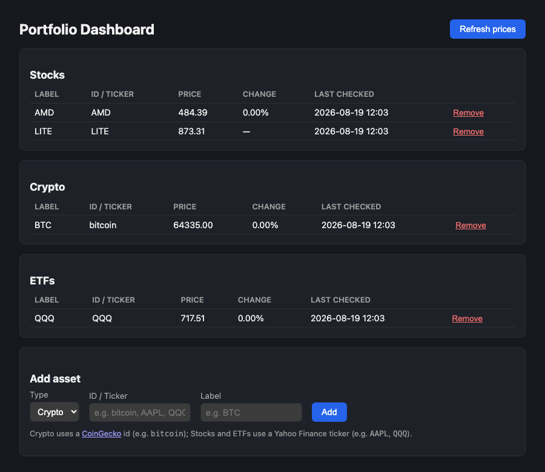

# Portfolio Dashboard

A Spring Boot web app for tracking crypto, stock, and ETF prices in a
browser — a web-based companion to [`portfolio-alert`](../portfolio-alert),
which does the same tracking via a scheduled script and email alerts. This
app is for browsing and managing your list of assets and their current
prices on demand.

No API keys needed for prices: crypto comes from
[CoinGecko](https://www.coingecko.com/en/api), stocks and ETFs from Yahoo
Finance's public quote endpoint.



## Stack

- Java 17, Spring Boot 4 (Web MVC, Data JPA, Thymeleaf, Validation)
- H2 file-based database (`./data/portfolio-dashboard`, gitignored) — no
  separate database server needed
- Maven (via the included `mvnw` wrapper)

## Running it

```bash
./mvnw spring-boot:run
```

Then open http://localhost:8080. The app creates its H2 database file on
first run.

The H2 web console (for poking at the database directly) is available at
http://localhost:8080/h2-console — use JDBC URL
`jdbc:h2:file:./data/portfolio-dashboard`.

## Usage

- **Add asset**: pick a type (Crypto / Stocks / ETFs) and enter an ID and
  label.
  - Crypto uses a CoinGecko coin id, e.g. `bitcoin`, `ethereum`.
  - Stocks and ETFs use a Yahoo Finance ticker, e.g. `AAPL`, `QQQ`.
- **Refresh prices**: fetches the current price for every tracked asset and
  shows the % change since the previous refresh. Assets are grouped into
  Stocks, Crypto, and ETFs sections, same as the alert emails from
  `portfolio-alert`.
- **Remove**: stops tracking an asset.

Unlike `portfolio-alert`, this app doesn't currently send email alerts or
refresh on a schedule — refreshing is manual, triggered by the "Refresh
prices" button. It's a straightforward next step to add a `@Scheduled` job
and reuse the email-sending logic if that's wanted later.

## Project layout

```
src/main/java/com/reeann/portfoliodashboard/
├── model/       Asset entity, AssetType enum
├── repository/  Spring Data JPA repository
├── service/     Price fetching (CoinGecko/Yahoo) and asset CRUD/refresh logic
└── web/         DashboardController (Thymeleaf views)
src/main/resources/
├── templates/dashboard.html
└── static/css/style.css
```
